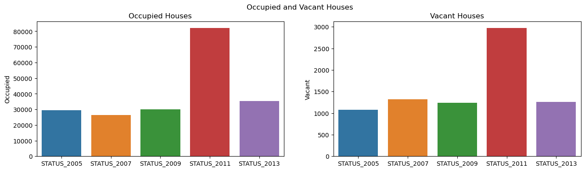

### Reading Data and Importing Modules


```python
# Change working directory
import os
os.chdir("D:\Rice_Uni_Business_Analytics_Capstone\Data")
```


```python
# Data files with extension .txt
txt_files = [item for item in os.listdir() if item.endswith(".txt")]
txt_files
```


    ['thads2001.txt',
     'thads2003.txt',
     'thads2005.txt',
     'thads2007.txt',
     'thads2009.txt',
     'thads2011.txt',
     'thads2013.txt']


```python
# Columns slected to be used for analysis
usecols = ["CONTROL", "AGE1", "METRO3", "REGION", "LMED", "FMR", "IPOV", "BEDRMS", "BUILT", "STATUS", 
           "TYPE", "VALUE", "NUNITS","ROOMS", "PER", "ZINC2", "ZADEQ", "ZSMHC", "STRUCTURETYPE", 
           "OWNRENT", "UTILITY", "OTHERCOST", "COST06", "COST08","COST12", "COSTMED", "ASSISTED"]
```


```python
# Import modules
import pandas as pd
import numpy as np
import seaborn as sns
import matplotlib.pyplot as plt
import statsmodels.api as sm
from statsmodels.stats.outliers_influence import variance_inflation_factor
from statsmodels.formula.api import ols
from scipy import stats
import warnings
```


```python
data_2001 = pd.read_csv("thads2001.txt", sep=",", usecols=usecols)
data_2003 = pd.read_csv("thads2003.txt", sep=",", usecols=usecols)
data_2005 = pd.read_csv("thads2005.txt", sep=",", usecols=usecols)
data_2007 = pd.read_csv("thads2007.txt", sep=",", usecols=usecols)
data_2009 = pd.read_csv("thads2009.txt", sep=",", usecols=usecols)
data_2011 = pd.read_csv("thads2011.txt", sep=",", usecols=usecols)
data_2013 = pd.read_csv("thads2013.txt", sep=",", usecols=usecols)
```

### Data Manipulation and Statistical Analysis


```python
# Initialize a list
size_list = []
# Iterate over the length of txt_files to append the size of each file to the size_list. Select 
# only market values that are $1000 or more
for i in range(len(txt_files)):
    df = pd.read_csv(txt_files[i], sep=",", usecols=usecols)
    df = df[df["VALUE"] >= 1000]
    size_list.append(df.shape[0])
```


```python
# Print the size of each file as formated below
years = range(2001, 2015, 2)
for i in range(len(txt_files)):
    print("The number of housing units that have market values of $1,000 or more in {} is {}"
          .format(years[i], size_list[i]))
```

    The number of housing units that have market values of $1,000 or more in 2001 is 29381
    The number of housing units that have market values of $1,000 or more in 2003 is 33434
    The number of housing units that have market values of $1,000 or more in 2005 is 30514
    The number of housing units that have market values of $1,000 or more in 2007 is 27785
    The number of housing units that have market values of $1,000 or more in 2009 is 31317
    The number of housing units that have market values of $1,000 or more in 2011 is 85050
    The number of housing units that have market values of $1,000 or more in 2013 is 36675
    


```python
# Extract the names of the dataframes
def get_df_name(df):
    '''Extract the name of the data frame. Input of the function is the dataframe df'''
    name =[x for x in globals() if globals()[x] is df][0]
    return name
```


```python
# Change names of the `VALUE` and `STATUS` variables to match the year
def column_name_change(df):
    '''Change the names of the VALUE and STATUS columns. Input is a dataframe'''
    df.rename(columns={"VALUE": "VALUE_{}".format(get_df_name(df)[-4:]), 
                       "STATUS": "STATUS_{}".format(get_df_name(df)[-4:]), 
                       "FMR": "FMR_{}".format(get_df_name(df)[-4:])}, inplace = True)
```


```python
# Test
get_df_name(data_2001)
```


    'data_2001'


```python
dfs = [data_2005, data_2007, data_2009, data_2011, data_2013]
for df_name in dfs:
    column_name_change(df_name)
```


```python
# Now what is the average market value (in $) across all housing units for year 2005
data_2005[data_2005["VALUE_2005"] >= 1000]["VALUE_2005"].mean()
```


    246504.11244019138


```python
# Subsets of the dataframes - market value is $1000 or more
def f(df, x):
    return df[df[x] >= 1000]
```


```python
# A list of the yearly market value variables
yearly_value = ["VALUE_2005", "VALUE_2007", "VALUE_2009", "VALUE_2011", "VALUE_2013"]
# A list of yearly status
yearly_status = ["STATUS_2005", "STATUS_2007", "STATUS_2009", "STATUS_2011", "STATUS_2013"]
# A list of the dataframes of the years 2005 through 2013
dfs = [data_2005, data_2007, data_2009, data_2011, data_2013]

# Initialize the status list
status = []
# Iterate over the yearly data and group it by status to count the number of occupied vs. vacant apartments in these housing 
# units
for i in range(len(yearly_value)):
    status.append(f(dfs[i], yearly_value[i]).groupby([yearly_status[i]])[yearly_status[i]].count())

# Convert the list to a datafram
status_df = pd.DataFrame(status)    # '1': occupied, '3': not occupied
# Rename columns to Occupied and Vacant, respectively
status_df.rename(columns={"'1'": 'Occupied', "'3'": 'Vacant'}, inplace=True)
```


```python
fig, axes = plt.subplots(1, 2, sharex=True, figsize=(16,4))
fig.suptitle('Occupied and Vacant Houses')
axes[0].set_title('Occupied Houses')
axes[1].set_title('Vacant Houses')
sns.barplot(ax = axes[0], x = status_df.index, y = status_df.Occupied)
sns.barplot(ax = axes[1], x = status_df.index, y = status_df.Vacant)
```


    <Axes: title={'center': 'Vacant Houses'}, ylabel='Vacant'>


    

    


